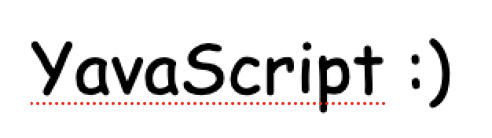

# 

YavaScript is a cross-platform bash-like script runner and repl which is distributed as a single statically-linked program, weighing in at about 4MB. Scripts can be written in [JavaScript](https://en.wikipedia.org/wiki/JavaScript) or [JS-related languages](#languages).

> YavaScript is the name of the program. YavaScript is not a new language. YavaScript uses normal JavaScript.

## Why?

YavaScript exists as an alternative to bash scripts. Instead of writing scripts using shell syntax and running them with bash, you write them in JavaScript and run them with YavaScript.

At only ~4MB and with no dependencies (not even Node.js), YavaScript is easy to install or include in a Docker image. As such, it's suitable for use in all the places you would use shell scripts now. It's a great fit for those sort of "environment-level infrastructure" scripts that every Git repo ends up needing, like "build the app", "pull the latest docker images", "install/use the correct versions of languages and tools", etc.

YavaScript has built-in APIs for all the things you'd normally want to do in a bash script, such as:

- Running programs
- Using environment variables
- Working with files/folders
- Resolving globs into lists of paths
- Printing stylized text

As well as APIs for things which are difficult or cumbersome in bash, like:

- (De)serialize JSON, CSV, YAML, and TOML
- Parse command-line flags into a structured object
- Safely manipulate and resolve path strings
- Work with raw byte buffers (typed arrays)
- Reliably get the path to the currently-running script
- Typed interfaces and functions (via TypeScript)
- Cross-file import/export using ECMAScript Modules
- Call low-level POSIX C APIs like fputs, sprintf, isatty

You'll also find cross-platform analogues to familiar CLI tools, like `mkdir`, `rm`, `chmod`, `dirname`, `which`, and more.

## APIs

**For the full API documentation, see [here](/meta/generated-docs/README.md).**

## Example

Here's an example of a script using YavaScript:

```js
#!/usr/bin/env yavascript

// Searches upwards from this file to find the root of the Git repository
const repoRoot = GitRepo.findRoot(__filename);

cd(repoRoot);

// Check if there are changes to the repo
const diffResult = exec("git diff --quiet", { failOnNonZeroStatus: false });
const isWorkingTreeDirty = diffResult.status !== 0;

// If there are, check whether .js files in lib/ have a matching .d.ts file. This is a contrived hypothetical thing you might run in CI.
if (isWorkingTreeDirty) {
  const jsFiles = glob("lib/**/*.js");
  for (const filePath of jsFiles) {
    // filePath is an instance of the Path class: https://github.com/suchipi/yavascript/blob/main/meta/generated-docs/path.md#path-class
    const dtsFilePath = filePath.replaceLast(
      filePath.basename().replace(/\.js$/, ".d.ts")
    );
    if (!exists(dtsFilePath)) {
      const displayPath = quote(dtsFilePath.relativeTo(repoRoot));
      let message = `Expected ${displayPath} to exist, but it didn't. Please add .d.ts files for all .js files under 'lib/'.`;

      // ANSI escape sequence helpers
      message = bold(yellow(message));

      // Writes to stderr
      console.error(messsage);
    }
  }
}

// Prepare some info for a deployment automation tool...
const branchName = $(`git rev-parse --abbrev-ref HEAD`).stdout.trim();
const gitInfo = { branchName, isWorkingTreeDirty };

// `echo` and `print` are aliases for `console.log`, for discoverability.
echo(gitInfo);

// YAML.stringify works like JSON.stringify. We also have CSV and TOML!
writeFile("git-info.yml", YAML.stringify(gitInfo));

// Need something lower-level? Use builtin POSIX APIs from QuickJS.
import * as std from "quickjs:std";
import * as os from "quickjs:os";

console.log(`Finished at ${std.strftime(64, "%Y-%m-%dT%H:%M:%S", Date.now())}`);
console.log(os.lstat(".gitignore").size);
console.log("Is tty?", os.isatty(std.in));
```

## How is that different from \_\_\_\_?

There are several other projects that bring a shell-like environment to JS, such as [zx](https://github.com/google/zx), [ShellJS](https://www.npmjs.com/package/shelljs), and [Bun Shell](https://bun.sh/docs/runtime/shell). The main difference between those and YavaScript is that YavaScript is very small, fully cross-platform, and brings its own JavaScript engine. The effect of those differences is that you can rely on YavaScript in places where you couldn't always rely on zx/shelljs/bun, like in your bootstrapping script that installs Node, or your smallest Docker containers. Or even on tiny constrained systems, like your router!

## Supported Platforms

- macOS (10.16 or higher)
  - Intel Processors (x86_64)
  - Apple Silicon (aarch64)
- Linux
  - aarch64 or x86_64
  - glibc, muslc, or statically-linked
- Windows (MinGW, not all APIs are supported)
  - x86_64

## Installation

You can find the binary for your platform on [the releases page](https://github.com/suchipi/yavascript/releases). As YavaScript is fully self-contained in one small file, it's trivial to install and uninstall; simply place it somewhere specified in your [`PATH`](https://superuser.com/a/284351).

## Languages

YavaScript can load and run any of these languages with no ahead-of-time compilation step needed:

- JavaScript
- [TypeScript](https://www.typescriptlang.org/)
- [JSX/TSX](https://react.dev/learn/writing-markup-with-jsx)
- [CoffeeScript](https://coffeescript.org/)
- [Civet](https://civet.dev/)

## TypeScript Types

YavaScript comes with a TypeScript type definition (`.d.ts`) file.

The `.d.ts` file contains documented TypeScript type definitions which can be given to your IDE to assist you when writing scripts, even if you aren't writing your scripts in TypeScript.

You can [view the `.d.ts` file online](./yavascript.d.ts), but if you have YavaScript installed, you should instead run `yavascript --print-types` to obtain the `.d.ts` file for your specific release.

You can put this comment at the top of your script to instruct VS Code to load the type information from the `.d.ts` file, which will improve the quality of Intellisense, error checking, and autocomplete, even if you aren't using TypeScript:

```ts
/// <reference path="./yavascript.d.ts" />
```

## QuickJS

YavaScript is powered by a fork of the QuickJS JavaScript Engine, originally
written by Fabrice Bellard. QuickJS is a small, fast JavaScript engine
supporting the ES2020 specification.

- Original QuickJS engine: https://bellard.org/quickjs/
- The fork we use: https://github.com/suchipi/quickjs/

## Compiling from Source

You'll need to install these prerequisites:

- [Node.js](https://nodejs.org/en)
- [Ninja](https://ninja-build.org/)
- [fnm](https://github.com/Schniz/fnm) (optional)

Then run `meta/build.sh`. The compiled output will be in the `dist` folder:

> If you didn't install fnm, use `env SKIP_FNM_USE=1 meta/build.sh` instead.

- `dist/yavascript`: The binary for your platform
- `dist/bin/*`: Binaries for all supported platforms
- Other files in `dist/`: Intermediate build artifacts

### Building the Docker image

You will need docker installed. After building binaries for all platforms, ensure yavascript is in your PATH, then run `meta/docker/build-image.sh`.

---

YavaScript is written with <3 by Lily Skye.
